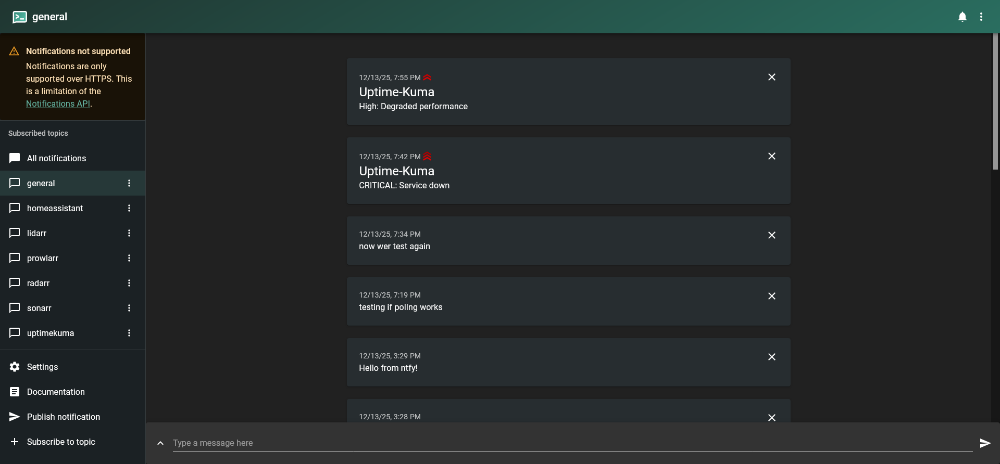
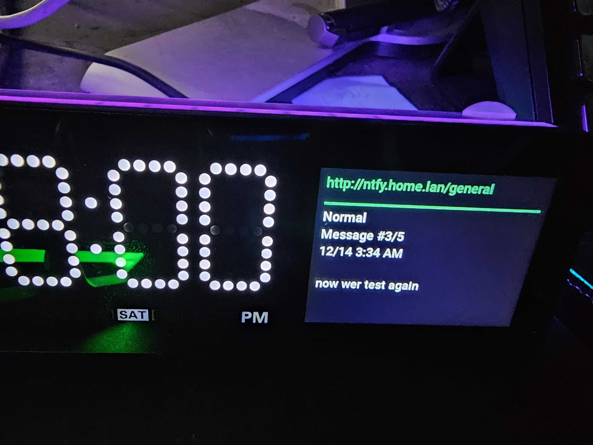
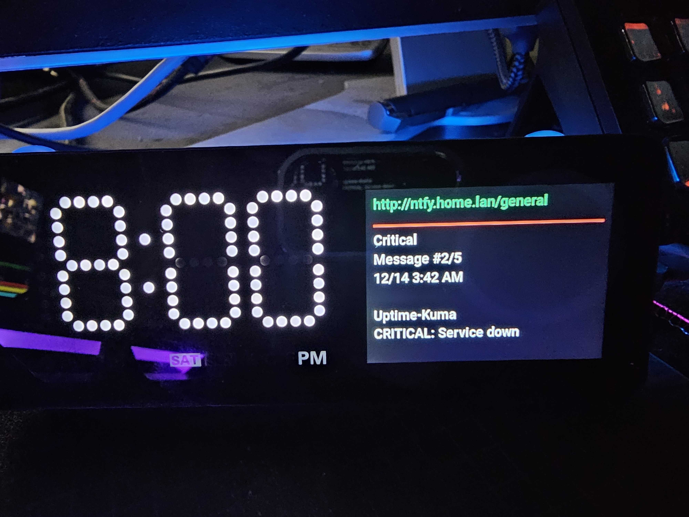

# ntfy App for Vobot Mini Dock

A MicroPython notification viewer for self-hosted ntfy servers.

## Overview

Displays push notifications from an ntfy server on your Vobot Mini Dock. Navigate through messages with the rotary encoder and stay updated on alerts, reminders, and notifications.

## Features

- Real-time notification display
- Navigate messages with rotary encoder
- Message counter integrated into header (e.g., "Message #2/5")
- Timestamped messages (MM/DD h:MM AM/PM)
- Automatic fetching (every 30 seconds)
- Configurable cache size (default last 5 messages)
- Priority indicator with colored dot and label (Min/Low/Normal/High/Critical)
- "NEW" badge appears on new message, auto-hides after 5s or on navigation

## Screenshots

<table>
<tr>
<td width="50%">

<p align="center"><em>Web Setup Interface</em></p>
</td>
<td width="50%">

<p align="center"><em>Normal Priority (Green)</em></p>
</td>
</tr>
<tr>
<td width="50%">

<p align="center"><em>High Priority (Orange)</em></p>
</td>
<td width="50%">

<p align="center"><em>Critical Priority (Red)</em></p>
</td>
</tr>
</table>


## Requirements

- Vobot Mini Dock with Developer Mode enabled
- Self-hosted ntfy server (tested with v2.x)
- WiFi connection

## Quick Start

See the main [repository README](../../README.md) for general setup and installation instructions.

### ntfy Server Configuration

This app connects to: `http://ntfy.home.lan/general`

To change the server or topic, edit `__init__.py`:

```python
NTFY_SERVER = "http://your-ntfy-server"
NTFY_TOPIC = "your-topic"
```

**Web Setup:** Configure `max_messages` via the device web UI (Settings → Apps → ntfy). Default is `5` and can be set between `1–50`.

To return to normal operation:

1. Navigate back to **Settings → Miscellaneous → Experimental Features**
2. Disable **Developer Mode**
3. Power cycle the device (disconnect and reconnect power)

⚠️ **Note**: Developer mode must be enabled for Thonny to access the device filesystem and view debug logs.

## Installation


## Usage

### Controls

| Action | Function |
|--------|----------|
| Rotate counter-clockwise | View newer message |
| Rotate clockwise | View older message |
| Press ESC | Exit to app menu |

### Display

Header (below the horizontal separator):

```
— line color reflects priority (green=Normal, orange=High, red=Critical, blue=Low, gray=Min)
Normal
Message #1/5
12/13 7:19 PM

Title (optional)
The message body goes here...
```

- Title at top-left: `ntfy:general` (green on success, red if error connecting)
- "NEW" badge at top-right when a new message arrives (auto-hides after ~5 seconds or when you scroll)

## Testing

Send test notifications:

```bash
# Simple message
curl -d "Hello Vobot!" http://ntfy.home.lan/general

# With title
curl -H "Title: Alert" -d "Disk space low" http://ntfy.home.lan/general

# Priority examples (1=min, 2=low, 3=normal, 4=high, 5=critical)
# Aliases: min, low, default|normal, high, urgent|critical

# Critical (red dot)
curl -H "Priority: 5" -H "Title: Uptime-Kuma" -d "CRITICAL: Service down" http://ntfy.home.lan/general

# High (orange dot)
curl -H "Priority: high" -H "Title: Uptime-Kuma" -d "High: Degraded performance" http://ntfy.home.lan/general

# Normal (green dot)
curl -H "Priority: default" -H "Title: Info" -d "Normal: All good" http://ntfy.home.lan/general

# Low (blue dot)
curl -H "Priority: low" -H "Title: FYI" -d "Low: heads-up only" http://ntfy.home.lan/general

# Min (gray dot)
curl -H "Priority: min" -H "Title: Debug" -d "Minimal detail" http://ntfy.home.lan/general
```

Optional headers:

- Tags: `-H "Tags: green-circle,rocket"`
- Click URL: `-H "Click: https://uptime.home.lan"`

## Troubleshooting

### No messages appear
- Check WiFi: Vobot must be connected
- Verify ntfy server is accessible: `ping ntfy.home.lan`
- Check logs for errors (see main README)

### Scroll wheel doesn't work
- Ensure app is focused (launch from menu)
- Check that focus group is set up (see code)

### App crashes
- Check memory usage (reduce message cache if needed)
- Review device logs for errors
- If emoji show as squares, that’s expected (device font lacks emoji). The app uses colored indicators instead.

## Technical Details

- **Version:** 0.0.4
- **Platform:** ESP32-S3 (MicroPython)
- **UI Framework:** LVGL 8.x
- **Dependencies:** urequests, ujson, utime
- **Fetch interval:** Configurable (default 10 seconds)
- **Message cache:** Last `MAX_MESSAGES` messages (default 5, 24-hour window)

## Resources

- [ntfy Documentation](https://docs.ntfy.sh/)
- [Vobot Developer Docs](https://dock.myvobot.com/developer/)
- [Official Vobot Apps](https://github.com/myvobot/dock-mini-apps)
- [My Vobot Community Forum Announcement](https://discuss.myvobot.com/t/nfty-app-polls-a-ntfy-server-and-displays-last-n-messages-with-new-ones-surface-to-top-configurable/385)

---

- **Version:** 0.0.4  
- **Last Updated:** December 14, 2025

## Future Enhancements

- Subscription mode (reduce polling):
	- Switch to ntfy long-poll JSON (`/{topic}/json?since=<ts>&poll=1`) to keep the connection open and return immediately on new messages, then re-issue the request. This lowers latency and overhead compared to fixed-interval polling.
	- Consider SSE (`/{topic}/sse`) if MicroPython streaming is stable; requires incremental parsing of server-sent events and robust reconnection.
	- WebSocket (`/{topic}/ws`) is efficient but may be heavier for ESP32 MicroPython (TLS, memory). Evaluate feasibility.
- Settings: Add a `subscription_mode` toggle in web setup to choose between fixed-interval polling and long-poll.
- Configurable `fetch_interval` in web setup (added), with bounds 5–120 seconds.
- https://www.perplexity.ai/search/does-self-hosted-lxc-https-doc-vzHfNXoWRu6gLBMyT070ew#0