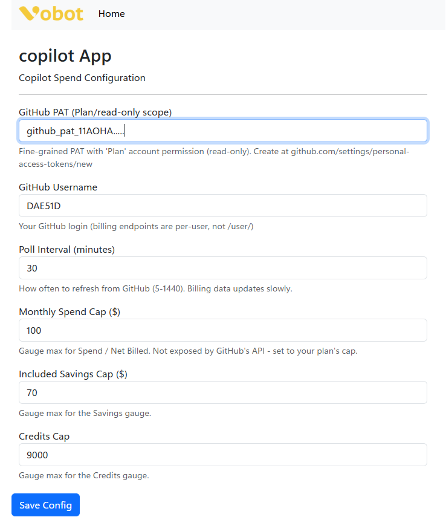
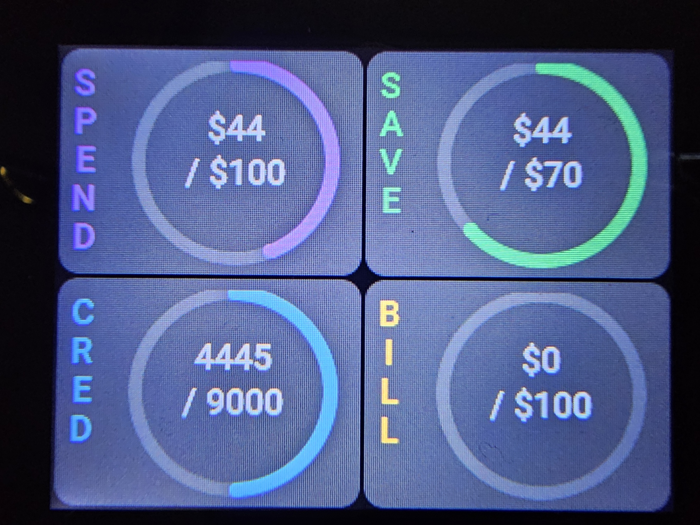
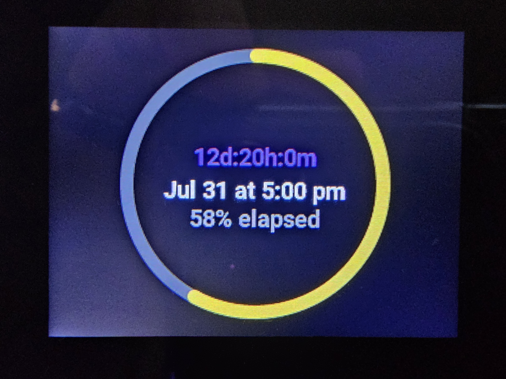
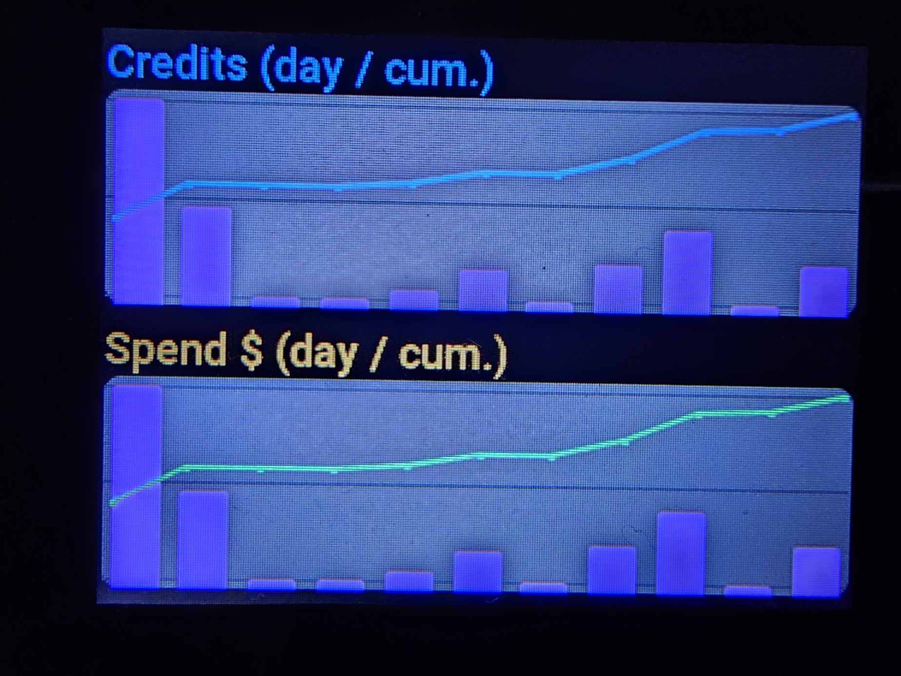

# Copilot Spend App for Vobot Mini Dock

A MicroPython [GitHub Copilot](https://github.com/features/copilot) billing dashboard for the Vobot Mini Dock — spend gauges, daily usage charts, and a billing-cycle countdown, all pulled directly from GitHub's REST API.

## Overview

Displays your current-month GitHub Copilot spend as four arc gauges, a daily/cumulative usage history as two charts, and a countdown to your next billing reset with a color-coded progress ring. Three pages, navigated with the rotary wheel.

## Features

- **Page 1 — Gauges:** Spend, Savings (discount), Credits, and Billed (net), each as a full-size arc with a vertical side label
- **Page 2 — Charts:** daily bars + cumulative line for both credits and dollar spend this month
- **Page 3 — Reset:** countdown to the next billing cycle (`Xd:Xh:Xm`), reset date/time, and a ring that shifts green → yellow → orange → red as the billing period progresses
- Rotary encoder navigation (LEFT/RIGHT to switch pages)
- ENTER forces an immediate refresh instead of waiting for the next poll
- Polls the GitHub API on a configurable interval (default 30 min — billing data doesn't change fast enough to justify more)

## Screenshots

<table>
<tr>
    <td width="50%">
        
        <p align="center"><em>Web Setup Interface</em></p>
    </td>
    <td width="50%">
        
        <p align="center"><em>Plan Reset</em></p>
    </td>
</tr>
<tr>
    <td width="50%">
        
        <p align="center"><em>Plan Reset</em></p>
    </td>
    <td width="50%">
        
        <p align="center"><em>Daily Chart</em></p>
    </td>
</tr>
</table>

## Requirements

- Vobot Mini Dock with Developer Mode enabled
- A GitHub account with Copilot usage (personal account, not org-managed seats)
- WiFi connection

## GitHub PAT Setup

This app reads GitHub's billing REST API, which requires a **fine-grained personal access token** with read-only billing access. It does **not** use your GitHub password and never writes anything to your account.

1. Go to **[github.com/settings/personal-access-tokens/new](https://github.com/settings/personal-access-tokens/new)**
2. Give it a name (e.g. `vobot-copilot-app`) and set an expiration you're comfortable with
3. Under **Account permissions**, set **Plan** to **Read-only** — this is the *only* permission this app needs
4. Generate the token and copy it (starts with `github_pat_...`)

> You can review/revoke tokens you've already created at `github.com/settings/personal-access-tokens/<id>` — but always create *new* ones from the `/new` URL above.

The public REST API only returns **aggregate totals** (dollar amounts, credit quantities) for your account — it does not expose your plan's included-usage caps or a per-model breakdown (those are only rendered on the authenticated `github.com/settings/billing` web page, which requires a logged-in browser session, not a PAT). That's why the gauge caps below are settings you fill in yourself rather than something the app can look up.

## Web Configuration

Configure via the web interface at `http://192.168.1.32/apps/copilot`:

| Field | Default | Notes |
|---|---|---|
| GitHub PAT | *(required)* | Fine-grained PAT with `Plan` read-only permission (see above) |
| GitHub Username | *(required)* | Your GitHub login — billing endpoints are per-user, not `/user/` |
| Poll Interval (minutes) | 30 | 5–1440. Billing data updates slowly, no need to poll often |
| Monthly Spend Cap ($) | 100 | Gauge max for Spend / Billed — not exposed by GitHub's API, set to your plan's cap |
| Included Savings Cap ($) | 70 | Gauge max for the Savings gauge |
| Credits Cap | 9000 | Gauge max for the Credits gauge |

⚠️ **Note**: Developer mode must be enabled for Thonny to access the device filesystem and view debug logs.

## Installation

```powershell
.venv\Scripts\python.exe -m py_compile apps/copilot/__init__.py

# Push to Vobot (Windows PowerShell example - run from repository root)
# Simple upload (use the `copilot/apps/copilot` local path)
Start-Sleep -Seconds 1; & ".\.venv\Scripts\python.exe" -m ampy.cli --port COM4 --baud 115200 --delay 2 put copilot/apps/copilot /apps/copilot
# Force-stop other PowerShell instances then upload (if needed)
Get-Process | Where-Object {$_.Name -eq 'pwsh' -and $_.Id -ne $PID} | Stop-Process -Force; Start-Sleep -Seconds 2; & ".\.venv\Scripts\python.exe" -m ampy.cli --port COM4 --baud 115200 --delay 2 put copilot/apps/copilot /apps/copilot
```

### Troubleshooting `ampy.exe`
If you encounter "Failed to canonicalize script path" when running the venv `ampy.exe`, prefer the module entrypoint instead:

```powershell
& ".\.venv\Scripts\python.exe" -m pip install --upgrade adafruit-ampy
& ".\.venv\Scripts\python.exe" -m ampy.cli --port COM4 --baud 115200 --delay 2 put copilot/apps/copilot /apps/copilot
```

Or install `adafruit-ampy` globally and use the `ampy` command from PATH:

```powershell
pip install --user adafruit-ampy
ampy --port COM4 --baud 115200 --delay 2 put copilot/apps/copilot /apps/copilot
```

When in doubt, use Thonny's file view to upload the `copilot` folder to `/apps/copilot` — it is the most reliable option on Windows.

## Usage

### Controls

| Action | Function |
|--------|----------|
| Rotate wheel | Switch between the 3 pages |
| Press ENTER | Force an immediate refresh from GitHub |

### Pages

#### 1. Gauges

Four arcs, each `used / cap`, all reflecting **current calendar month** totals from GitHub's billing summary:

| Gauge | What it shows | Source |
|---|---|---|
| **Spend** | Gross $ value of Copilot usage this month, *before* any discount is applied | `grossAmount` |
| **Save** | $ value covered by your plan's included-usage discount (i.e. what you *didn't* pay) | `discountAmount` |
| **Cred** | Gross quantity of AI credits (or premium requests, on older plans) consumed | `grossQuantity` |
| **Bill** | Net $ actually billed after the discount — this is the number that shows up on your card | `netAmount` |

`Spend` and `Bill` share the same $ cap (Monthly Spend Cap setting) since they're both dollar figures on the same scale; in practice `Bill` stays low/zero as long as your discount covers your usage, and only climbs once you exceed your plan's included allowance.

#### 2. Charts

Two stacked-widget panels — a **bar** series (daily) behind a **line** series (cumulative running total for the month), sharing one x-axis (day of month, oldest to newest):

- **Credits (day / cum.)**: daily credit/request quantity (bars) and the running total (line) — same metric as the `Cred` gauge, just broken out per day
- **Spend $ (day / cum.)**: daily *gross* $ value (bars) and running total (line) — same metric as the `Spend` gauge, per day

Both charts use **gross** values (pre-discount), matching the gauges on page 1 — not net billed amount, since that's often ~$0 all month if your plan's discount covers everything.

#### 3. Reset

- Big centered text: countdown to the next billing reset (`Xd:Xh:Xm`), the reset date/time in your local timezone, and `% elapsed` through the current billing period
- The ring is a **time** indicator, not a spend indicator — it fills as the calendar month progresses (0% at the 1st, 100% at reset) and shifts color green → yellow → orange → red the closer you get to reset, purely as a visual "how far into the month are we" cue

## Troubleshooting

### Gauges show $0 / stay empty
- Check that both PAT and Username are filled in on the web config page
- A `403` means the token is missing/invalid — GitHub's API also requires a `User-Agent` header, which this app already sends, so a 403 almost always means the PAT itself is wrong or expired
- A `404`/empty means the username doesn't match the account the PAT belongs to

### Charts are empty
- Needs at least one day of usage data in the current calendar month
- Check device logs (see main README) for `history fetch error` or `HTTP` codes

### Reset countdown looks off
- GitHub's billing cycle always resets at **00:00:00 UTC on the 1st of the month** — the countdown converts this to your device's local timezone, so double-check the device's configured timezone if the date looks wrong

## Technical Details

- **Version:** 1.0.0
- **Platform:** ESP32-S3 (MicroPython)
- **UI Framework:** LVGL 9.1 (arcs, stacked bar+line charts, labels)
- **Dependencies:** urequests, utime, clocktime
- **Data:** GitHub REST Billing API — `settings/billing/usage/summary` (current-month aggregate) and `settings/billing/usage` (daily breakdown)
- **Polling:** 30 minutes (configurable, 5–1440)

## Resources

- [GitHub REST API Billing Docs](https://docs.github.com/en/rest/billing)
- [GitHub Copilot Billing Cycle](https://docs.github.com/en/copilot/reference/copilot-billing/billing-cycle)
- [Vobot Developer Docs](https://dock.myvobot.com/developer/)
- [Official Vobot Apps](https://github.com/myvobot/dock-mini-apps)
- [LVGL widgets](https://docs.lvgl.io/master/widgets/index.html)

## Authentication

Uses a fine-grained GitHub PAT with `Plan` (read-only) account permission — see [GitHub PAT Setup](#github-pat-setup) above. The token is stored only in the device's local config and is never sent anywhere except `api.github.com`.

## License

[baba-yaga](https://github.com/ErikMcClure/bad-licenses/blob/master/baba-yaga)

In other words, YOLO. IDGAF what you do with this. Have fun. Make it better. Make a million dollars off it. Learn something new (as I did). Make the community a better place by contributing to it something for the sad sad "[app store](https://app.myvobot.com/)"
