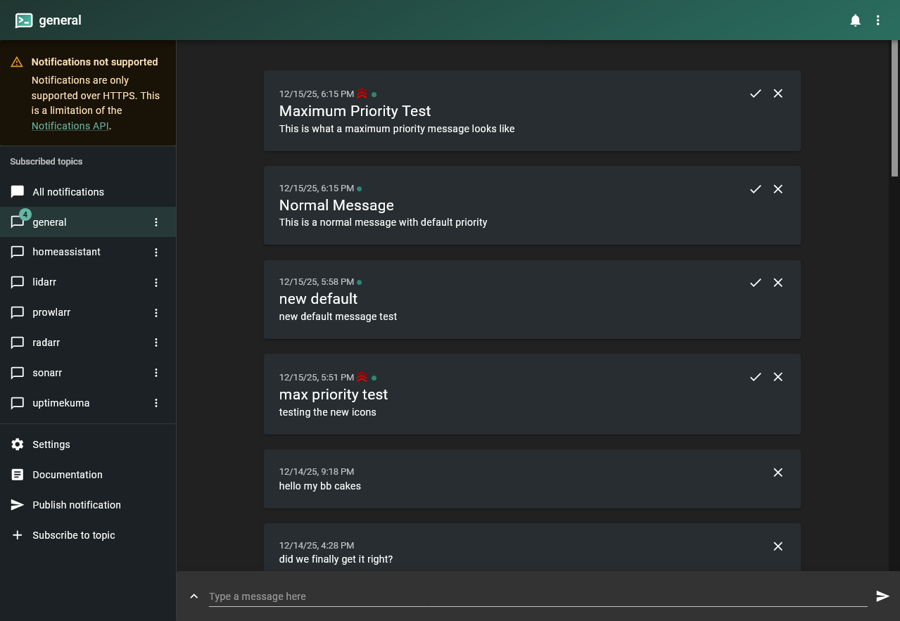
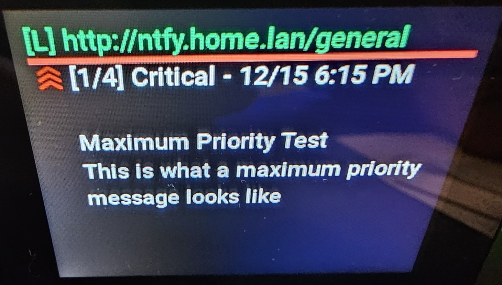

# ntfy App for Vobot Mini Dock

A MicroPython notification viewer for self-hosted ntfy servers.

## Overview

Displays push notifications from an ntfy server on your Vobot Mini Dock. Navigate through messages with the rotary encoder and stay updated on alerts, reminders, and notifications.

## Features

- Real-time notification display
- Navigate messages with rotary encoder
- Message counter integrated into header (e.g., "Message #2/5")
- Timestamped messages (MM/DD h:MM AM/PM)
- Automatic fetching (every 30 seconds)
- Configurable cache size (default last 5 messages)
- Priority indicator with colored dot and label (Min/Low/Normal/High/Critical)
- "NEW" badge appears on new message, auto-hides after 5s or on navigation

## Screenshots

> Note these screenshots will not always be accurate to the current version. Newer displays look nicer IMHO, but I'm too lazy to take more photos and all that jazz just now. I'm too busy getting this app solid. Then I'll align things later as it's stable UI. But you get the idea of what this does.

<table>
<tr>
<td width="50%">

<p align="center"><em>Web Setup Interface</em></p>
</td>
<td width="50%">

<p align="center"><em>Critical Priority (Red)</em></p>
</td>
</tr>
</table>

## Requirements

- Vobot Mini Dock with Developer Mode enabled
- Self-hosted ntfy server (tested with v2.x)
- WiFi connection

## Quick Start

See the main [repository README](../README.md) for general setup and installation instructions.

### ntfy Server Configuration

Configure via the web interface at http://192.168.1.32/apps/ntfy:

- **Server URL:** Your ntfy server (e.g., `http://ntfy.home.lan`)
- **Topic(s):** Comma-separated topics (e.g., `general` or `alerts,builds`). ntfy requires at least one topic; wildcards/all-topics are not supported.
- **Fetch Interval:** Polling frequency in seconds (2-120, default 10)
- **Max Cached Messages:** Number of messages to store (1-20, default 5)
- **Connection Mode:** Polling or Long-poll (SSE removed)

To return to normal operation:

1. Navigate back to **Settings → Miscellaneous → Experimental Features**
2. Disable **Developer Mode**
3. Power cycle the device (disconnect and reconnect power)

⚠️ **Note**: Developer mode must be enabled for Thonny to access the device filesystem and view debug logs.

## Installation

```powershell
.venv\Scripts\python.exe -m py_compile apps/ntfy/__init__.py

# Push to Vobot (Windows PowerShell example - run from repository root)
# Simple upload (use the `ntfy/apps/ntfy` local path)
Start-Sleep -Seconds 1; & ".\.venv\Scripts\python.exe" -m ampy.cli --port COM4 --baud 115200 --delay 2 put ntfy/apps/ntfy /apps/ntfy
# Force-stop other PowerShell instances then upload (if needed)
Get-Process | Where-Object {$_.Name -eq 'pwsh' -and $_.Id -ne $PID} | Stop-Process -Force; Start-Sleep -Seconds 2; & ".\.venv\Scripts\python.exe" -m ampy.cli --port COM4 --baud 115200 --delay 2 put ntfy/apps/ntfy /apps/ntfy

### Troubleshooting `ampy.exe`
If you encounter "Failed to canonicalize script path" when running the venv `ampy.exe`, prefer the module entrypoint instead:

```powershell
& ".\.venv\Scripts\python.exe" -m pip install --upgrade adafruit-ampy
& ".\.venv\Scripts\python.exe" -m ampy.cli --port COM4 --baud 115200 --delay 2 put ntfy/apps/ntfy /apps/ntfy
```

Or install `adafruit-ampy` globally and use the `ampy` command from PATH:

```powershell
pip install --user adafruit-ampy
ampy --port COM4 --baud 115200 --delay 2 put ntfy/apps/ntfy /apps/ntfy
```

When in doubt, use Thonny's file view to upload the `ntfy` folder to `/apps/ntfy` — it is the most reliable option on Windows.

## Usage

### Controls

| Action | Function |
|--------|----------|
| Rotate counter-clockwise | View newer message |
| Rotate clockwise | View older message |
| Press ESC | Exit to app menu |

### Display

Header (below the horizontal separator):

```
[P|L] http://ntfy.home.lan/topic  {new icon}
— line color reflects priority (green=Normal, orange=High, red=Critical, blue=Low, gray=Min)
{icon} [1/5] {priority} - mm/dd h:mm pm

Title <if exists>
The message body goes here...
```
- [P|L] indicates Polling or Long-Polling (default)
- Title (green on success, red if error connecting)
- "NEW" badge at top-right when a new message arrives (auto-hides after ~5 seconds or when you scroll)

## Testing

Send test notifications:

```bash
# Simple message
curl -d "Hello Vobot!" http://ntfy.home.lan/general

# With title
curl -H "Title: Alert" -d "Disk space low" http://ntfy.home.lan/general

# Priority examples (1=min, 2=low, 3=normal, 4=high, 5=critical)
# Aliases: min, low, default|normal, high, urgent|critical

# Critical (red dot)
curl -H "Priority: 5" -H "Title: Uptime-Kuma" -d "CRITICAL: Service down" http://ntfy.home.lan/general

# High (orange dot)
curl -H "Priority: high" -H "Title: Uptime-Kuma" -d "High: Degraded performance" http://ntfy.home.lan/general

# Normal (green dot)
curl -H "Priority: default" -H "Title: Info" -d "Normal: All good" http://ntfy.home.lan/general

# Low (blue dot)
curl -H "Priority: low" -H "Title: FYI" -d "Low: heads-up only" http://ntfy.home.lan/general

# Min (gray dot)
curl -H "Priority: min" -H "Title: Debug" -d "Minimal detail" http://ntfy.home.lan/general
```

Optional headers:

- Tags: `-H "Tags: green-circle,rocket"`
- Click URL: `-H "Click: https://uptime.home.lan"`

## Troubleshooting

### No messages appear
- Check WiFi: Vobot must be connected
- Verify ntfy server is accessible: `ping ntfy.home.lan`
- Check logs for errors (see main README)

### Scroll wheel doesn't work
- Ensure app is focused (launch from menu)
- Check that focus group is set up (see code)

### App crashes
- Check memory usage (reduce message cache if needed)
- Review device logs for errors
- If emoji show as squares, that’s expected (device font lacks emoji). The app uses colored indicators instead.

## Technical Details

- **Version:** 1.0.0
- **Platform:** ESP32-S3 (MicroPython)
- **UI Framework:** LVGL 8.x
- **Dependencies:** urequests, ujson, utime
- **Default mode:** Long-poll (real-time, stable)
- **Message cache:** Last `MAX_MESSAGES` messages (default 5, 24-hour window)

## Resources

- [ntfy Documentation](https://docs.ntfy.sh/)
- [Vobot Developer Docs](https://dock.myvobot.com/developer/)
- [Official Vobot Apps](https://github.com/myvobot/dock-mini-apps)
- [My Vobot Community Forum Announcement](https://discuss.myvobot.com/t/nfty-app-polls-a-ntfy-server-and-displays-last-n-messages-with-new-ones-surface-to-top-configurable/385)
- [My announcement "issue" the ntfy Github repo](https://github.com/binwiederhier/ntfy/issues/1514)
- [App in gallery](https://app.myvobot.com/app-detail/ntfy) ID: `6940c5ce565a2f001d74ad12`

## Connection Modes

The app supports two message delivery methods (configure via web settings):

### Polling
- Fetches messages every N seconds (configurable, default 10s)
- Simple and reliable
- Uses `/json?poll=1&since=24h` endpoint
- **Use when:** You don't mind slight delays (10+ seconds)

### Long-poll (Default)
- Keeps HTTP connection open, returns immediately when new message arrives
- Much lower latency than polling (near real-time)
- Automatically reconnects after each message
- Uses `/json?poll=1&since=<last_time_seen>` endpoint
- **Recommended:** Default mode for better responsiveness with stable WiFi

**Note:** Both modes require stable WiFi. If experiencing frequent disconnects, use Polling mode with a longer interval.

### SSE (Removed)
SSE (Server-Sent Events) mode was tested but removed due to architectural limitations in MicroPython:
- Blocking read behavior caused UI responsiveness issues (sluggish encoder)
- Continuous loop without data resulted in system lag
- Device's 200ms polling model incompatible with SSE's persistent streaming design
- Long-poll provides similar latency benefits with better stability

If you need SSE-level responsiveness, long-poll is the recommended alternative.

## Authentication

**Currently there is no user/password or token authentication.** 
I don't use it as my ntfy LXC is on my home LAN and not exposed.

If enough people ask for it, I could add it, but given the niche demographic here, I decided not to bloat the app with needless code.

- https://docs.ntfy.sh/config/#access-tokens

## License

[baba-yaga](https://github.com/ErikMcClure/bad-licenses/blob/master/baba-yaga)

In other words, YOLO. IDGAF what you do with this. Have fun. Make it better. Make a million dollars off it. Learn something new (as I did). Make the community a better place by contributing to it something for the sad sad "[app store](https://app.myvobot.com/)"

---

- **Version:** 1.0.0  
- **Last Updated:** December 14, 2025