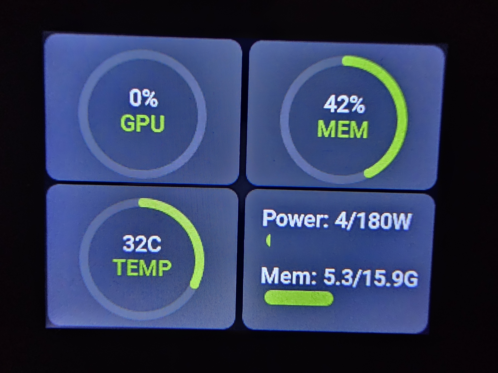
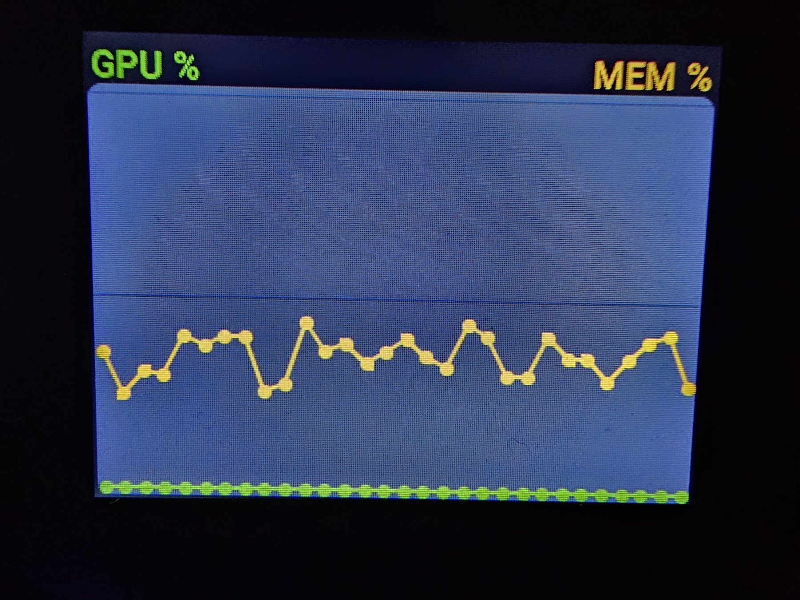

# nvtop App for Vobot Mini Dock

A MicroPython NVIDIA GPU monitor for the Vobot Mini Dock.

## Overview

`nvtop` shows live GPU telemetry from a small companion REST service, `vobot-gpu-daemon`, running on the machine that actually has the NVIDIA GPU.

The app currently provides a 4-page UI:

- Gauges page with GPU, memory, temperature, and power/memory bars
- History page with GPU, memory-used, and memory-activity trend lines plus 25/50/75% gridlines
- Details page with clocks, PCIe info, performance state, throttle reasons, and daemon/app build info
- Processes page listing the top GPU-memory processes, with full command-line args and its own encoder-driven scroll mode

Gauges/History auto-cycle between themselves; Details/Processes are manual-only detours (auto-cycle resumes once you leave them). All pages can also be changed directly with the Vobot rotary encoder.

## Features

- Live GPU utilization gauge
- Live VRAM utilization gauge
- Temperature gauge with hot-state color change
- Power draw bar and memory usage bar
- Rolling history chart for GPU %, memory-used %, and memory-activity %, with 25/50/75% gridlines and a 0%/100% border
- Details page with clocks, PCIe link, P-state, throttle reason text, and the daemon's + app's git commit (so you always know what's actually running)
- Processes page: top GPU-memory processes, each showing `argv0`, `GPU/CPU/PID`, and every CLI flag on its own line, separated by a rule; press **ENTER** to toggle a content-scroll mode where the encoder scrolls the list instead of paging apps (press **ENTER** or **ESC** to exit back to normal paging)
- Configurable polling interval and page auto-cycle
- Works with multi-GPU hosts via configurable GPU index
- All `requests.get()` calls use a 10s timeout — a slow/unreachable daemon can't freeze the whole device

## Screenshots

<table>
<tr>
    <td width="33%">
        
        <p align="center"><em>Web Setup Interface</em></p>
    </td>
    <td width="33%">
        
        <p align="center"><em>Quadrants</em></p>
    </td>
    <td width="33%">
        
        <p align="center"><em>GPU MEM graph</em></p>
    </td>
</tr>
</table>

## Requirements

- Vobot Mini Dock with Developer Mode enabled
- WiFi connection
- An NVIDIA GPU host reachable on your LAN
- `vobot-gpu-daemon` running on that host

## Quick Start

See the main [repository README](../README.md) for general Vobot setup and upload instructions.

### GPU Daemon Requirement

This app does not run `nvidia-smi` on the Vobot. It reads JSON from a small helper service running on your PC, server, or Proxmox host.

Default endpoint:

```text
http://proxmox.home.lan:8039/api/gpu-data
```

Daemon files live here:

- [nvtop-daemon/README.md](../nvtop-daemon/README.md)
- [nvtop-daemon/vobot_gpu_daemon.py](../nvtop-daemon/vobot_gpu_daemon.py)

## Configuration

Configure via the Vobot web UI at:

```text
http://192.168.1.32/apps/nvtop
```

Settings:

- **GPU Daemon Server:** Base URL of the daemon, for example `http://proxmox.home.lan:8039`
- **GPU Index:** Which GPU to display, default `0`
- **Poll Interval:** Fetch interval in seconds, default `2`
- **Page Cycle Seconds:** Auto-cycle interval between pages, default `5`
- **Auto-Cycle Pages:** Enable or disable automatic page rotation

## Installation

```powershell
.venv\Scripts\python.exe -m py_compile apps/nvtop/__init__.py

# Push to Vobot (Windows PowerShell example - run from repository root)
& ".\.venv\Scripts\python.exe" -m ampy.cli --port COM4 --baud 115200 --delay 2 put nvtop/apps/nvtop /apps/nvtop
```

If `ampy.exe` gives you Windows path weirdness, prefer the module entrypoint:

```powershell
& ".\.venv\Scripts\python.exe" -m pip install --upgrade adafruit-ampy
& ".\.venv\Scripts\python.exe" -m ampy.cli --port COM4 --baud 115200 --delay 2 put nvtop/apps/nvtop /apps/nvtop
```

When in doubt, Thonny file upload is still the least annoying option on Windows.

## Usage

### Controls

| Action                                  | Function                                                        |
| ---------------------------------------- | ----------------------------------------------------------------- |
| Rotate clockwise / counter-clockwise    | Change pages (or scroll the process list, in scroll mode)       |
| Wait                                    | Auto-cycle between Gauges/History if enabled                    |
| Press ENTER (on Processes page)         | Toggle content-scroll mode                                      |
| Press ENTER or ESC (in scroll mode)     | Exit scroll mode, back to normal page navigation                |
| Press ESC (not in scroll mode)          | Exit app                                                         |

### Pages

#### Gauges

- GPU utilization arc
- Memory utilization arc
- Temperature arc
- Power draw bar
- Memory usage bar (`used / total`)

#### History

- GPU percent trend line
- Memory-used percent trend line
- Memory-activity percent trend line
- 25/50/75% horizontal gridlines, 0%/100% framed by the chart border

#### Details

- GPU name and driver version
- Graphics and memory clocks
- Fan percent
- PCIe current and max link
- Performance state
- Throttle reasons
- Daemon commit + app version/commit (`Daemon: <hash>  App: <version> (<hash>)`)

#### Processes

- Top GPU-memory processes (by default the top 4), each rendered as:
  ```
  /opt/llama-cpp/bin/llama-server
  GPU: 5460 MiB   CPU: 1%   PID: 3237629
  --foo bar
  --fee fum
  ```
  (argv0, then a summary line, then every CLI flag with its value on its own line)
- A dashed rule separates consecutive processes
- Press **ENTER** to enter scroll mode (header turns blue, "ENTER/ESC to exit") — the encoder then scrolls the list instead of changing pages, so long argument lists are fully readable

## Troubleshooting

### App opens but shows no data

- Verify the daemon host is up
- Check the configured server URL
- Test the endpoint from another machine:

```bash
curl http://proxmox.home.lan:8039/api/gpu-data
```

### App does not appear in Vobot

- Confirm the folder exists at `/apps/nvtop`
- Restart the device after upload
- Make sure `manifest.yml` and `__init__.py` are present

### Scroll wheel does nothing

- Re-open the app from the app list
- If it still ignores input, restart the dock and re-enter the app

### COM4 / upload errors

- Close Thonny, serial monitors, and any other process using the port
- Retry the `ampy` command

## Technical Details

- **Version:** 1.0.3
- **Platform:** ESP32-S3 (MicroPython)
- **UI Framework:** LVGL
- **Dependencies:** `urequests`, `utime`, `lvgl`, `peripherals`
- **Backend:** JSON API from `vobot-gpu-daemon`
- **Build tracking:** `GIT_COMMIT` is stamped at deploy time from `git rev-parse --short HEAD` and shown on the Details page next to the daemon's own commit

## Resources

- [Vobot Developer Docs](https://dock.myvobot.com/developer/)
- [LVGL Docs](https://docs.lvgl.io/)
- [Official Vobot Apps](https://github.com/myvobot/dock-mini-apps)
- [gpu-hot](https://github.com/psalias2006/gpu-hot) for inspiration only

## License

[baba-yaga](https://github.com/ErikMcClure/bad-licenses/blob/master/baba-yaga)

In other words, YOLO. Use it, change it, break it, improve it.
