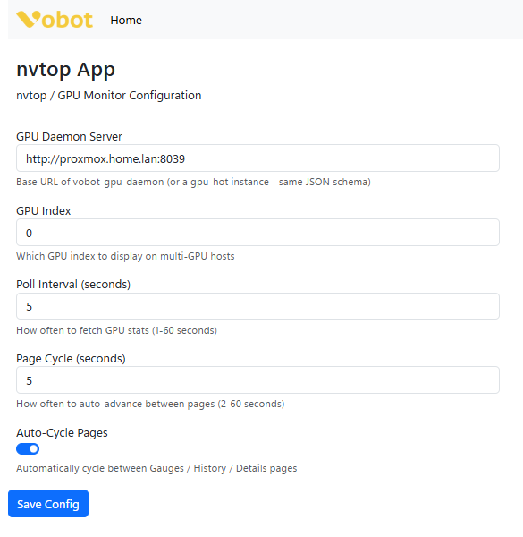

# nvtop App for Vobot Mini Dock

A MicroPython NVIDIA GPU monitor for the Vobot Mini Dock.

## Overview

`nvtop` shows live GPU telemetry from a small companion REST service, `vobot-gpu-daemon`, running on the machine that actually has the NVIDIA GPU.

The app currently provides a 3-page UI:

- Gauges page with GPU, memory, temperature, and power/memory bars
- History page with GPU and memory utilization trends
- Details page with clocks, PCIe info, performance state, and throttle reasons

Pages can auto-cycle and can also be changed with the Vobot rotary encoder.

## Features

- Live GPU utilization gauge
- Live VRAM utilization gauge
- Temperature gauge with hot-state color change
- Power draw bar and memory usage bar
- Rolling history chart for GPU and memory percent
- Details page with clocks, PCIe link, P-state, and throttle reason text
- Configurable polling interval and page auto-cycle
- Works with multi-GPU hosts via configurable GPU index

## Screenshots

<table>
<tr>
<td width="50%">

<p align="center"><em>Web Setup Interface</em></p>
</td>
</tr>
</table>

## Requirements

- Vobot Mini Dock with Developer Mode enabled
- WiFi connection
- An NVIDIA GPU host reachable on your LAN
- `vobot-gpu-daemon` running on that host

## Quick Start

See the main [repository README](../README.md) for general Vobot setup and upload instructions.

### GPU Daemon Requirement

This app does not run `nvidia-smi` on the Vobot. It reads JSON from a small helper service running on your PC, server, or Proxmox host.

Default endpoint:

```text
http://proxmox.home.lan:8039/api/gpu-data
```

Daemon files live here:

- [nvtop-daemon/README.md](../nvtop-daemon/README.md)
- [nvtop-daemon/vobot_gpu_daemon.py](../nvtop-daemon/vobot_gpu_daemon.py)

## Configuration

Configure via the Vobot web UI at:

```text
http://192.168.1.32/apps/nvtop
```

Settings:

- **GPU Daemon Server:** Base URL of the daemon, for example `http://proxmox.home.lan:8039`
- **GPU Index:** Which GPU to display, default `0`
- **Poll Interval:** Fetch interval in seconds, default `2`
- **Page Cycle Seconds:** Auto-cycle interval between pages, default `5`
- **Auto-Cycle Pages:** Enable or disable automatic page rotation

## Installation

```powershell
.venv\Scripts\python.exe -m py_compile apps/nvtop/__init__.py

# Push to Vobot (Windows PowerShell example - run from repository root)
& ".\.venv\Scripts\python.exe" -m ampy.cli --port COM4 --baud 115200 --delay 2 put nvtop/apps/nvtop /apps/nvtop
```

If `ampy.exe` gives you Windows path weirdness, prefer the module entrypoint:

```powershell
& ".\.venv\Scripts\python.exe" -m pip install --upgrade adafruit-ampy
& ".\.venv\Scripts\python.exe" -m ampy.cli --port COM4 --baud 115200 --delay 2 put nvtop/apps/nvtop /apps/nvtop
```

When in doubt, Thonny file upload is still the least annoying option on Windows.

## Usage

### Controls

| Action | Function |
|--------|----------|
| Rotate clockwise / counter-clockwise | Change pages |
| Wait | Auto-cycle pages if enabled |
| Press ESC | Exit app |

### Pages

#### Gauges

- GPU utilization arc
- Memory utilization arc
- Temperature arc
- Power draw bar
- Memory usage bar (`used / total`)

#### History

- GPU percent trend line
- Memory percent trend line

#### Details

- GPU name and driver version
- Graphics and memory clocks
- Fan percent
- PCIe current and max link
- Performance state
- Throttle reasons

## Troubleshooting

### App opens but shows no data

- Verify the daemon host is up
- Check the configured server URL
- Test the endpoint from another machine:

```bash
curl http://proxmox.home.lan:8039/api/gpu-data
```

### App does not appear in Vobot

- Confirm the folder exists at `/apps/nvtop`
- Restart the device after upload
- Make sure `manifest.yml` and `__init__.py` are present

### Scroll wheel does nothing

- Re-open the app from the app list
- If it still ignores input, restart the dock and re-enter the app

### COM4 / upload errors

- Close Thonny, serial monitors, and any other process using the port
- Retry the `ampy` command

## Technical Details

- **Version:** 1.0.0
- **Platform:** ESP32-S3 (MicroPython)
- **UI Framework:** LVGL
- **Dependencies:** `urequests`, `utime`, `lvgl`, `peripherals`
- **Backend:** JSON API from `vobot-gpu-daemon`

## Resources

- [Vobot Developer Docs](https://dock.myvobot.com/developer/)
- [LVGL Docs](https://docs.lvgl.io/)
- [Official Vobot Apps](https://github.com/myvobot/dock-mini-apps)
- [gpu-hot](https://github.com/psalias2006/gpu-hot) for inspiration only

## License

[baba-yaga](https://github.com/ErikMcClure/bad-licenses/blob/master/baba-yaga)

In other words, YOLO. Use it, change it, break it, improve it.
