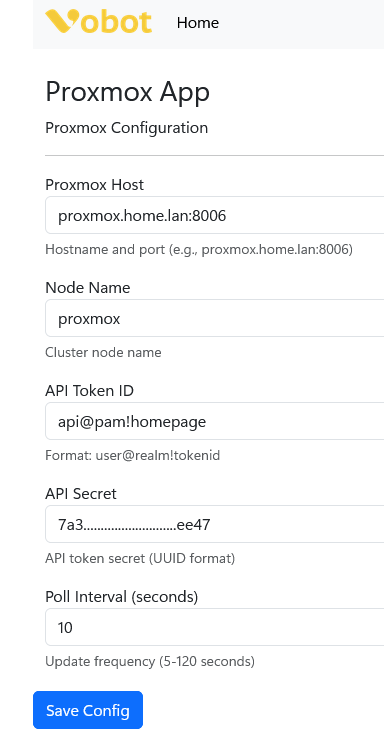
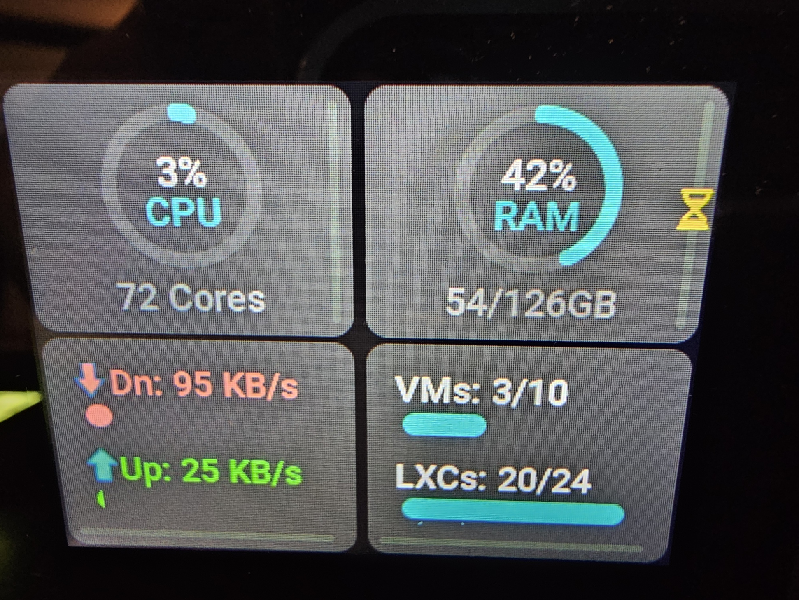
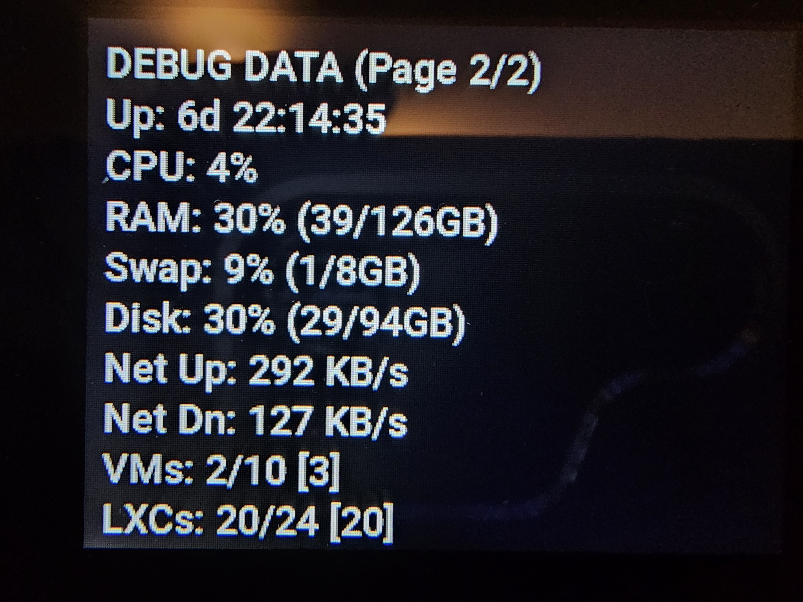

# Proxmox App for Vobot Mini Dock

A MicroPython [Proxmox](https://www.proxmox.com/en/products/proxmox-virtual-environment/overview) dashboard (CPU, RAM, network, VM/LXC counts) for the Vobot Mini Dock.

## Overview

Displays CPU/RAM gauges, network throughput, and VM/LXC counts from a Proxmox node. Two pages: main dashboard with arcs/bars and a debug text page. Navigate with the rotary wheel.

## Features

- Two-page UI: arc/bars dashboard plus text debug page
- CPU/RAM arcs, network in/out bars with arrows, VM/LXC bars
- Rotary encoder navigation (LEFT/RIGHT to switch pages)
- Polls Proxmox every 10 seconds, shows swap/disk/uptime on debug page

## Screenshots

> Note these screenshots will not always be accurate to the current version. Newer displays look nicer IMHO, but I'm too lazy to take more photos and all that jazz just now. I'm too busy getting this app solid. Then I'll align things later as it's stable UI. But you get the idea of what this does.

I want to emulate the PC HW app, but I can't find the source code!
https://discuss.myvobot.com/t/linux-cpu-gpu-temps/351/5

<table>
<tr>
<td width="50%">

<p align="center"><em>Web Setup Interface</em></p>
</td>
<td width="50%">

<p align="center"><em>Screenshot GUI</em></p>
</td>
<td width="50%">

<p align="center"><em>Screenshot Debug</em></p>
</td>
</tr>
</table>

## Requirements

- Vobot Mini Dock with Developer Mode enabled
- Self-hosted proxmox server (tested with v2.x)
- WiFi connection

## Quick Start

See the main [repository README](../README.md) for general setup and installation instructions.

### proxmox Server Configuration

Configure via the web interface at http://192.168.1.32/apps/proxmox:

⚠️ **Note**: Developer mode must be enabled for Thonny to access the device filesystem and view debug logs.

## Installation

```powershell
.venv\Scripts\python.exe -m py_compile apps/proxmox/__init__.py

# Push to Vobot (Windows PowerShell example - run from repository root)
# Simple upload (use the `proxmox/apps/proxmox` local path)
Start-Sleep -Seconds 1; & ".\.venv\Scripts\python.exe" -m ampy.cli --port COM4 --baud 115200 --delay 2 put proxmox/apps/proxmox /apps/proxmox
# Force-stop other PowerShell instances then upload (if needed)
Get-Process | Where-Object {$_.Name -eq 'pwsh' -and $_.Id -ne $PID} | Stop-Process -Force; Start-Sleep -Seconds 2; & ".\.venv\Scripts\python.exe" -m ampy.cli --port COM4 --baud 115200 --delay 2 put proxmox/apps/proxmox /apps/proxmox

### Troubleshooting `ampy.exe`
If you encounter "Failed to canonicalize script path" when running the venv `ampy.exe`, prefer the module entrypoint instead:

```powershell
& ".\.venv\Scripts\python.exe" -m pip install --upgrade adafruit-ampy
& ".\.venv\Scripts\python.exe" -m ampy.cli --port COM4 --baud 115200 --delay 2 put proxmox/apps/proxmox /apps/proxmox
```

Or install `adafruit-ampy` globally and use the `ampy` command from PATH:

```powershell
pip install --user adafruit-ampy
ampy --port COM4 --baud 115200 --delay 2 put proxmox/apps/proxmox /apps/proxmox
```

When in doubt, use Thonny's file view to upload the `proxmox` folder to `/apps/proxmox` — it is the most reliable option on Windows.

## Technical Details

- **Version:** 0.0.9
- **Platform:** ESP32-S3 (MicroPython)
- **UI Framework:** LVGL 8.x (arcs/bars/labels; png arrows via `lv.img`)
- **Dependencies:** urequests, ujson, utime
- **Data:** Proxmox status and RRD endpoints (CPU, mem/swap/disk, net KB/s, VM/LXC counts)
- **Polling:** 10 seconds

## Resources

- [Vobot Developer Docs](https://dock.myvobot.com/developer/)
- [Official Vobot Apps](https://github.com/myvobot/dock-mini-apps)
- [LVGL widgets](https://docs.lvgl.io/master/widgets/index.html)
- [Proxmox Forum Post](https://forum.proxmox.com/threads/proxmox-app-for-vobot-mini-dock-device.178138/)
- [Vobot Forum Post](https://discuss.myvobot.com/t/proxmox-h-w-monitor/389)

## Authentication

I used this guide to make a token: https://www.home-assistant.io/integrations/proxmoxve/

## License

[baba-yaga](https://github.com/ErikMcClure/bad-licenses/blob/master/baba-yaga)

In other words, YOLO. IDGAF what you do with this. Have fun. Make it better. Make a million dollars off it. Learn something new (as I did). Make the community a better place by contributing to it something for the sad sad "[app store](https://app.myvobot.com/)"
